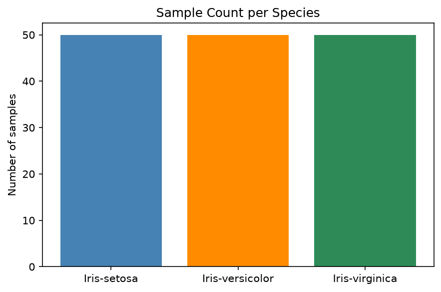
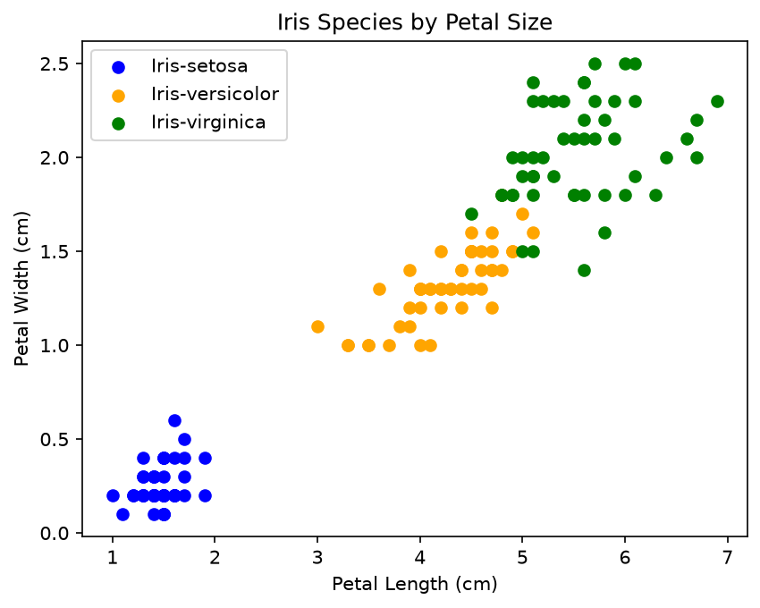
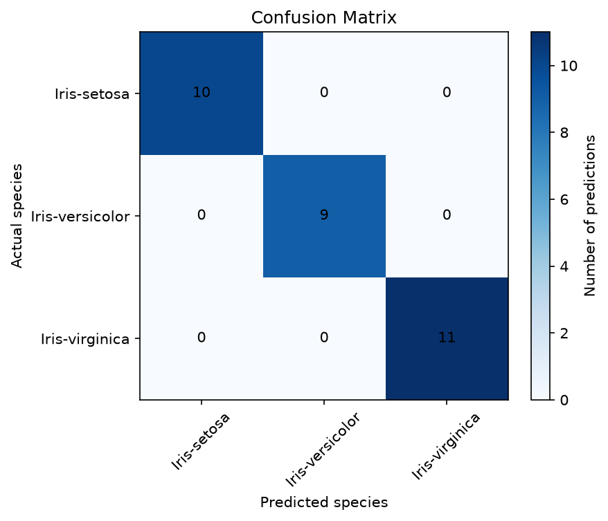
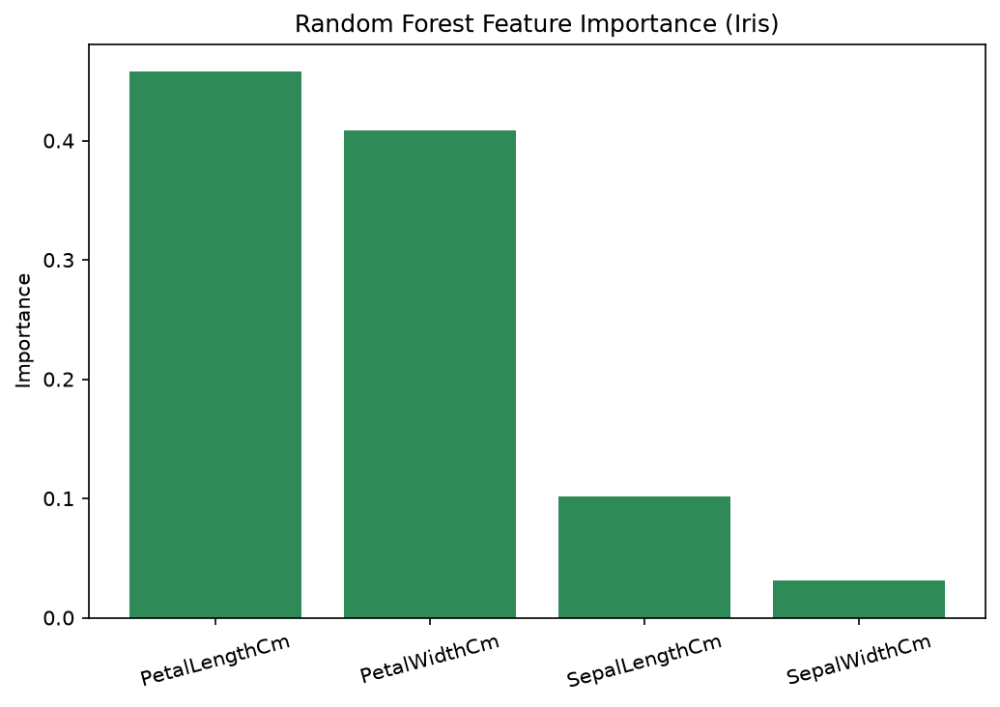
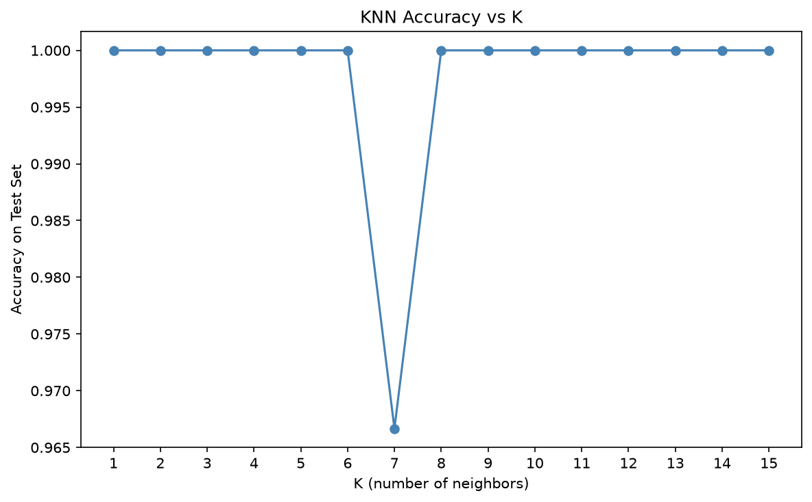

# CodeAlpha - Iris Flower Classification

## Overview
This project builds a machine learning model to classify iris flowers into one of three species — *setosa*, *versicolor*, or *virginica* — based on four physical measurements: sepal length, sepal width, petal length, and petal width.

This is Task 1 of my Data Science Internship at CodeAlpha.

## Dataset
The dataset used is the classic [Iris Species dataset](https://www.kaggle.com/datasets/uciml/iris) from Kaggle, containing 150 samples (50 per species) with no missing values.

| Species | Sample count | Avg. petal length (cm) | Avg. petal width (cm) |
|---|---|---|---|
| Iris-setosa | 50 | 1.46 | 0.24 |
| Iris-versicolor | 50 | 4.26 | 1.33 |
| Iris-virginica | 50 | 5.55 | 2.03 |

## Tools & Libraries
- Python
- pandas — data loading and exploration
- matplotlib — data visualization
- scikit-learn — model training and evaluation

## Approach
1. Loaded and explored the dataset (shape, summary statistics, class balance)
2. Visualized petal length vs. petal width by species to check class separability
3. Split the data into training (80%) and testing (20%) sets
4. Trained a K-Nearest Neighbors (KNN) classifier with k=5
5. Evaluated the model on unseen test data using accuracy, a classification report, and a confusion matrix

## Data exploration

Petal measurements separate the three species clearly, with *setosa* forming a tight, distinct cluster and *versicolor*/*virginica* showing only minor overlap:

## Results

The model achieved **100% accuracy** on the 30-flower test set.

| Species | Precision | Recall | F1-score |
|---|---|---|---|
| Iris-setosa | 1.00 | 1.00 | 1.00 |
| Iris-versicolor | 1.00 | 1.00 | 1.00 |
| Iris-virginica | 1.00 | 1.00 | 1.00 |

The confusion matrix below confirms every test flower was classified correctly — all values fall on the diagonal, with zero misclassifications between any species:

This strong performance is expected for the Iris dataset, since the three species are cleanly separable by petal measurements alone — a smaller, noisier real-world dataset would not typically score this high.

## Bonus Investigation

### Does a more complex model do any better?

KNN was compared against a Random Forest classifier on identical data:

| Model | Accuracy |
|---|---|
| KNN (k=5) | 100.00% |
| Random Forest | 100.00% |

Both models tied at a perfect score. This is expected -- Iris is cleanly separable enough that model choice barely matters here, unlike noisier real-world datasets where a more powerful model usually pulls ahead.

### Which measurement actually matters most?

Random Forest's feature importance turns the earlier visual observation (petal measurements separate species better than sepal ones) into a measured result:

| Feature | Importance |
|---|---|
| PetalLengthCm | 0.458 |
| PetalWidthCm | 0.409 |
| SepalLengthCm | 0.102 |
| SepalWidthCm | 0.031 |

Petal measurements account for **86.7%** of the model's decision-making, versus just **13.3%** for both sepal measurements combined -- confirming what the scatter plot suggested, now with hard numbers.

### Was k=5 actually the best choice?

Testing k values from 1 to 15 on the test set:

k=1 technically tied for the highest accuracy. In practice, though, k=1 is generally the riskiest choice for a KNN model -- it relies on a single nearest neighbor with no robustness against noise or a mislabeled point. It only performs this well here because Iris is unusually clean; k=5 (the original choice) remains a more defensible pick for a model expected to generalize beyond this specific dataset.

## How to Run
1. Clone this repository
2. Install dependencies: `pip install pandas scikit-learn matplotlib`
3. Run `CodeAlpha_IrisFlowerClassification.py`