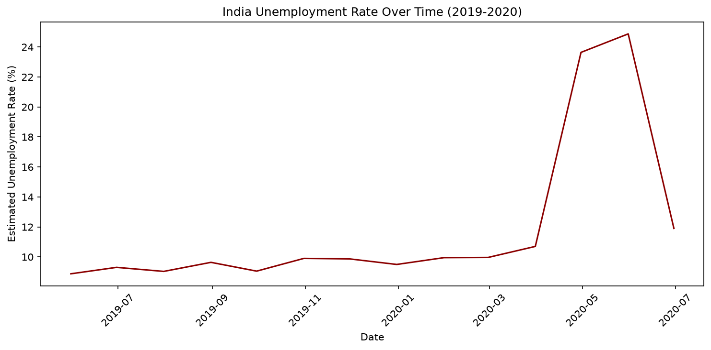
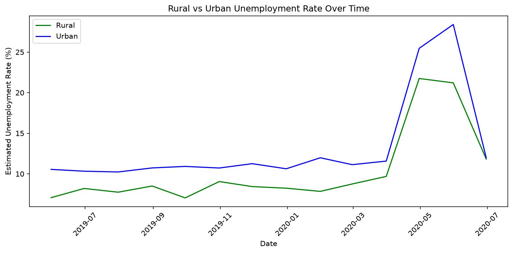
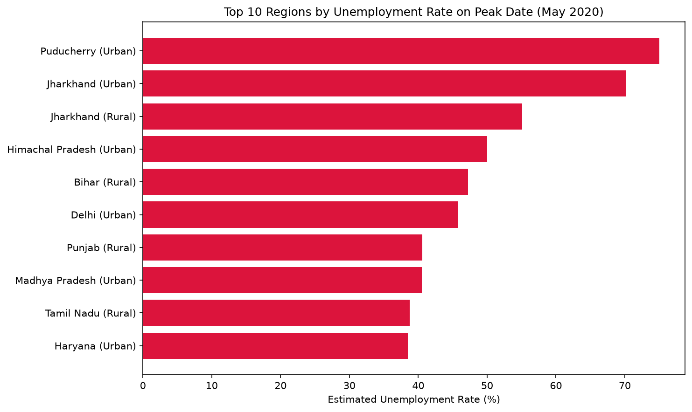
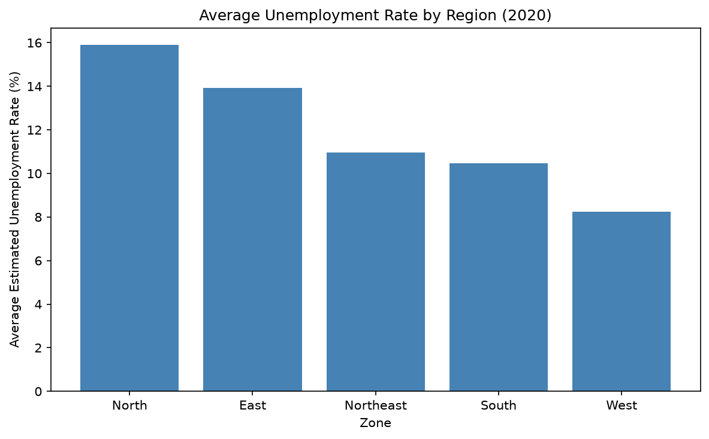
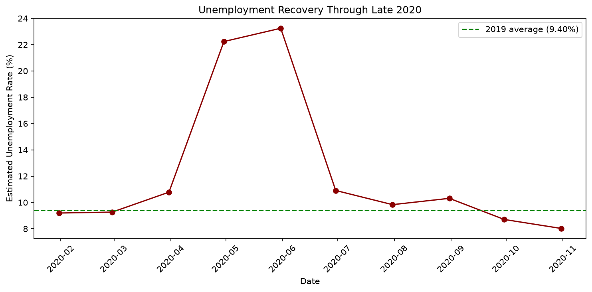

# CodeAlpha - Unemployment Analysis (India)

## Overview
This project analyzes unemployment trends in India using two datasets, with a specific focus on quantifying the impact of the Covid-19 lockdown on unemployment rates.

This is Task 2 of my Data Science Internship at CodeAlpha.

## Dataset
Two datasets from Kaggle's [Unemployment in India](https://www.kaggle.com/datasets/gokulrajkmv/unemployment-in-india) collection:

| File | Rows | Time range | Notes |
|---|---|---|---|
| `Unemployment in India.csv` | 740 (cleaned) | 2019-2020 | Includes Rural/Urban breakdown |
| `Unemployment_Rate_upto_11_2020.csv` | 267 | Jan-Nov 2020 | Includes regional Zone and coordinates |

## Tools & Libraries
- Python
- pandas — data cleaning and analysis
- matplotlib — data visualization

## Approach
1. Loaded both datasets and identified data quality issues: inconsistent column naming (extra whitespace in headers and values), 28 fully blank rows, and a duplicated column name
2. Cleaned column names and values, converted dates to proper datetime format, and dropped invalid rows
3. Visualized the national unemployment rate over time to identify the Covid-19 impact
4. Compared Rural vs Urban unemployment trends over time
5. Identified the exact peak date and the hardest-hit regions
6. Quantified the before/after Covid unemployment increase numerically
7. Compared average unemployment rates across India's broader geographic zones

## Data exploration

The national unemployment rate holds steady through 2019, then spikes sharply in early-to-mid 2020:

Both Rural and Urban areas were affected by the same shock, though not always equally:

## Results

### Before vs during Covid

| Period | Average unemployment rate |
|---|---|
| 2019 (before Covid) | 9.40% |
| Apr-Jun 2020 (Covid peak) | 20.19% |
| **Increase** | **+10.80 percentage points** |

Unemployment peaked nationally on **31 May 2020** at **24.88%**.

### Hardest-hit regions on the peak date

| Region | Area | Unemployment rate |
|---|---|---|
| Puducherry | Urban | 75.00% |
| Jharkhand | Urban | 70.17% |
| Jharkhand | Rural | 55.10% |
| Himachal Pradesh | Urban | 50.00% |
| Bihar | Rural | 47.26% |
| Delhi | Urban | 45.78% |
| Punjab | Rural | 40.59% |
| Madhya Pradesh | Urban | 40.49% |
| Tamil Nadu | Rural | 38.73% |
| Haryana | Urban | 38.46% |

### Unemployment by geographic zone (2020 average)

| Zone | Average unemployment rate |
|---|---|
| North | 15.89% |
| East | 13.92% |
| Northeast | 10.95% |
| South | 10.45% |
| West | 8.24% |

North India saw the highest average unemployment rate of any zone in 2020, while West India was the least affected.

## Bonus Investigation

### Is the before/after Covid gap statistically real?

A two-sample t-test was run comparing 2019 unemployment rates against the Apr-Jun 2020 peak:

| | Value |
|---|---|
| T-statistic | -7.95 |
| P-value | < 0.000001 |

With a p-value this far below the standard 0.05 threshold, the jump in unemployment is a statistically significant effect, not something explainable by random variation.

### Did unemployment actually recover?

Using Dataset 2's later 2020 months to check whether the rate came back down:

| | Average unemployment rate |
|---|---|
| 2019 (pre-Covid baseline) | 9.40% |
| November 2020 (latest available) | 8.03% |

By November 2020, the average rate had actually fallen *below* the pre-Covid baseline. One honest caveat: this compares figures from two separate source files, which may have slightly different regional sampling, so this should be read as a strong recovery signal rather than a perfectly like-for-like comparison.

## How to Run
1. Clone this repository
2. Install dependencies: `pip install pandas matplotlib`
3. Run `CodeAlpha_UnemploymentAnalysis.py`