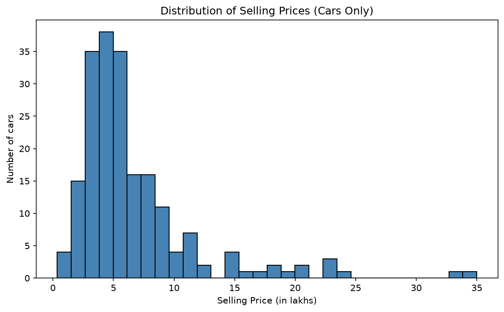
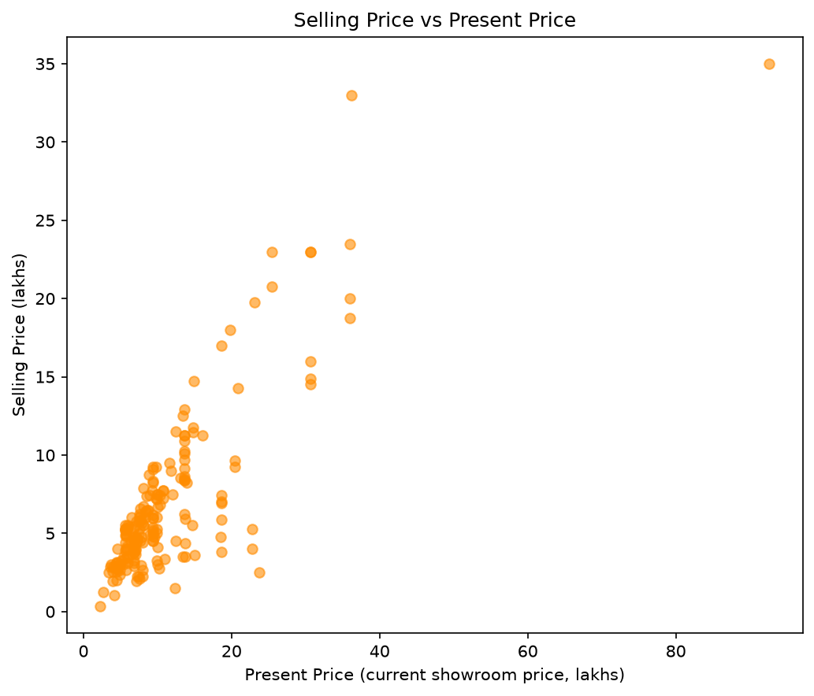
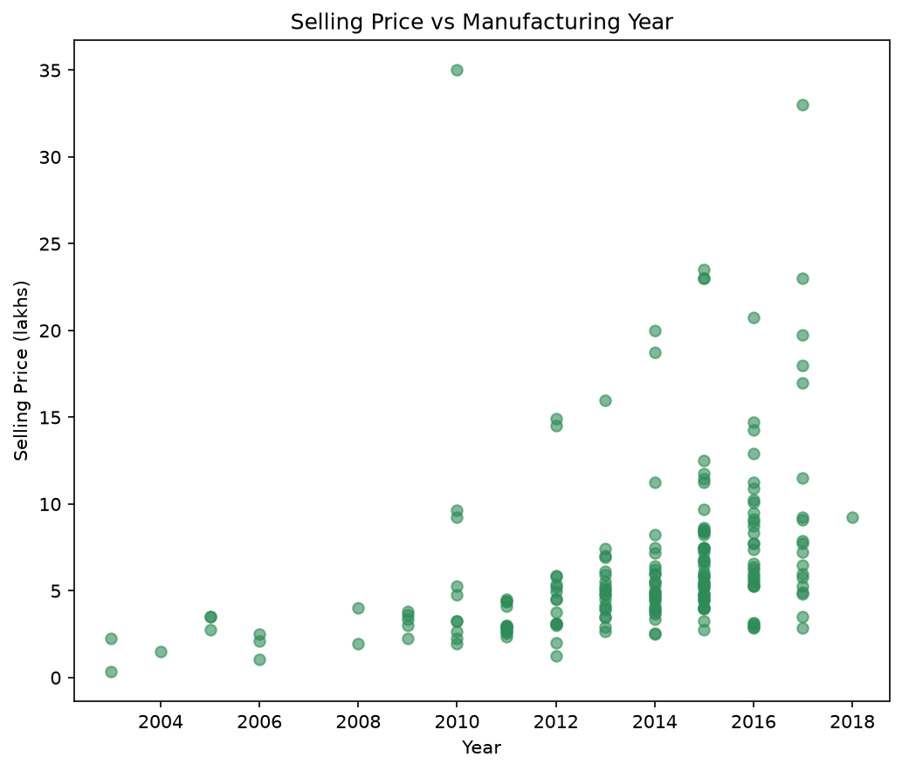
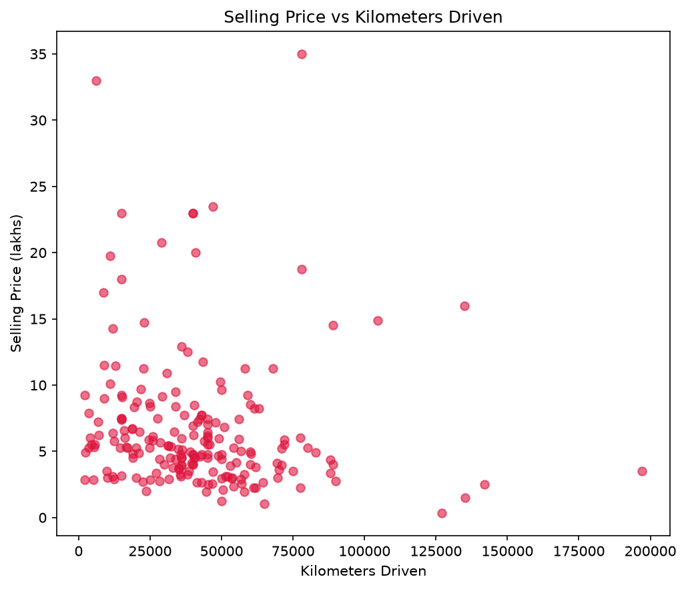
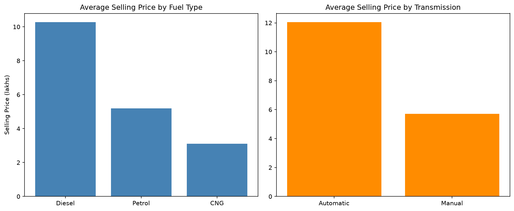
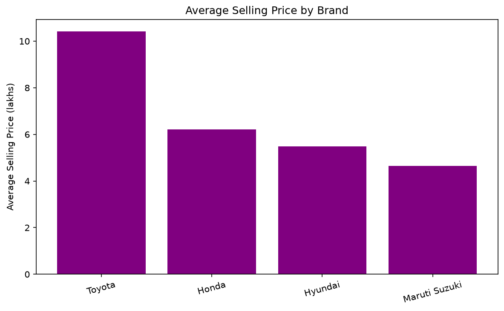
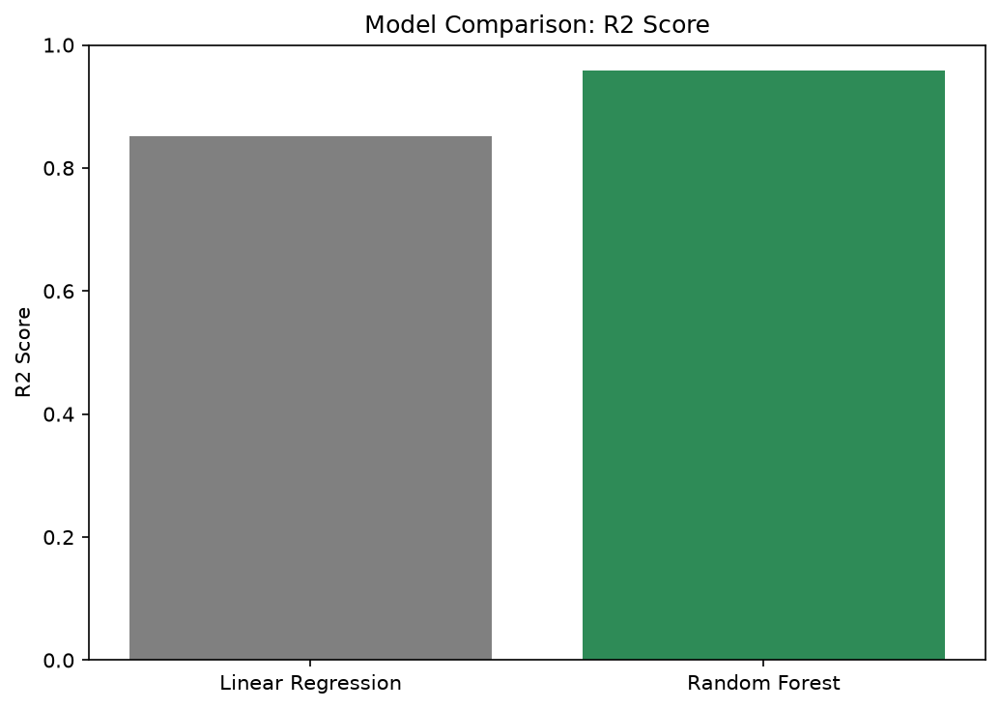
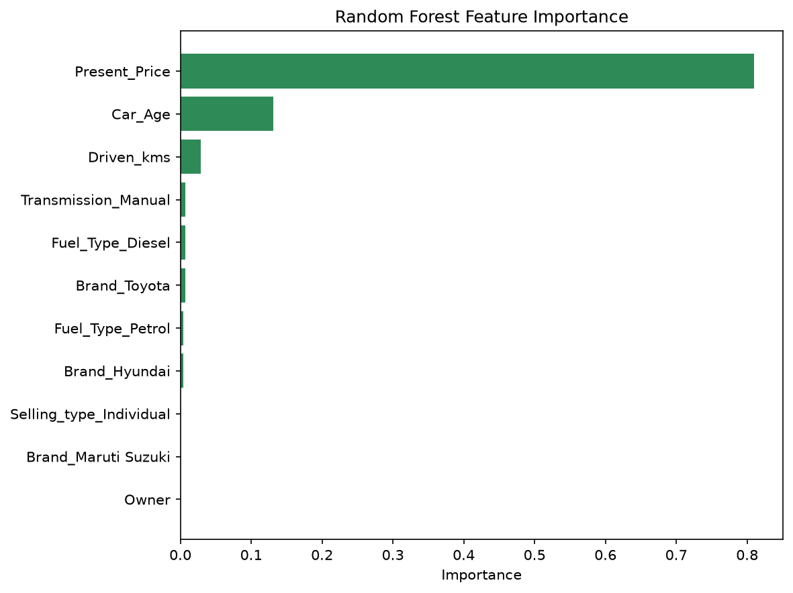
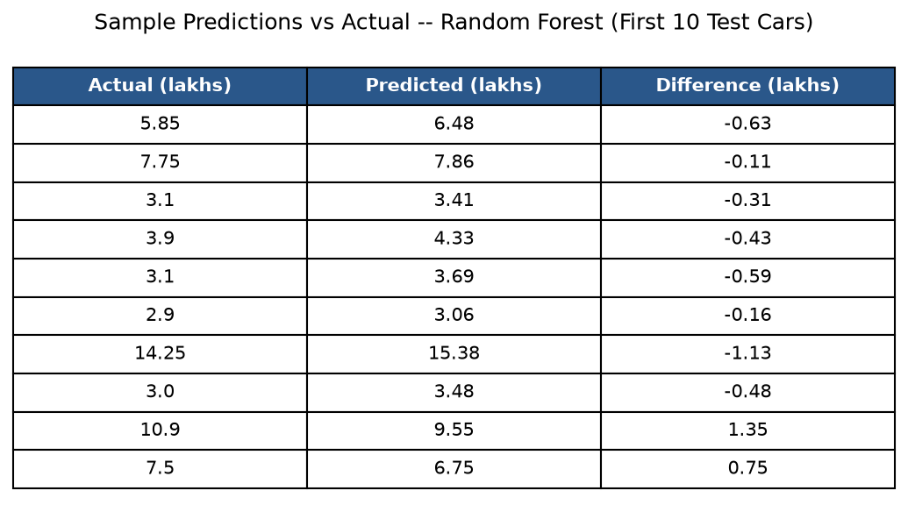
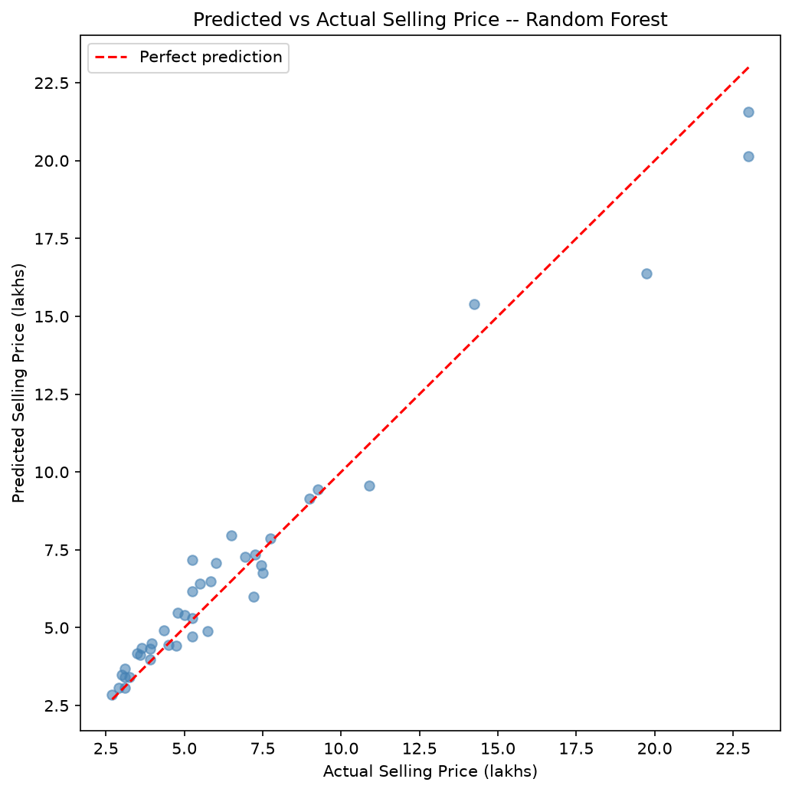

# CodeAlpha - Car Price Prediction

## Overview
This project builds a machine learning model to predict a used car's selling price based on features like its present (showroom) price, age, mileage, fuel type, transmission, and brand.

This is Task 3 of my Data Science Internship at CodeAlpha.

## Dataset
Sourced from Kaggle's [Vehicle dataset](https://www.kaggle.com/datasets/nehalbirla/vehicle-dataset-from-cardekho), originally 301 rows.

### Data quality discovery
While exploring the data, I found that the file actually mixed **100 motorcycle listings** (Bajaj, Hero, Honda bikes, Royal Enfield, TVS, Yamaha, KTM, etc.) in with real cars — some inconsistently labeled (e.g. `"Honda Activa 125"` vs. just `"Activa 3g"`). Motorcycles sit on a completely different price scale (avg. ~1 lakh) than cars (avg. ~11 lakhs), so leaving them in would train a "car price" model on the wrong problem entirely. All motorcycle rows were identified and removed, leaving **200 clean car records**.

| | Count |
|---|---|
| Original rows | 301 |
| Motorcycles removed | 100 |
| **Final car dataset** | **200** |

## Feature Engineering
- **Car_Age** — derived from `Year` (dataset collected ~2020), since a car's age is more directly meaningful than a raw year
- **Brand** — extracted from the car's model name (e.g. `"swift"` → Maruti Suzuki, `"innova"` → Toyota, `"creta"` → Hyundai, `"city"` → Honda) and one-hot encoded, directly testing whether brand reputation affects resale price
- **Fuel_Type, Selling_type, Transmission** — one-hot encoded from text into 0/1 columns
- `Car_Name` and raw `Year` dropped after extracting the features above

| Brand | Count |
|---|---|
| Maruti Suzuki | 50 |
| Toyota | 50 |
| Hyundai | 50 |
| Honda | 50 |

## Tools & Libraries
- Python
- pandas — data cleaning, feature engineering
- matplotlib — data visualization
- scikit-learn — model training and evaluation (Linear Regression, Random Forest)

## Approach
1. Loaded the data and identified/removed motorcycle listings mixed in with cars
2. Extracted a `Brand` feature from car model names and created `Car_Age` from `Year`
3. Explored relationships between price and each feature visually
4. One-hot encoded categorical features (Fuel_Type, Selling_type, Transmission, Brand)
5. Split data into training (80%) and testing (20%) sets
6. Trained and compared two models: Linear Regression and Random Forest Regressor
7. Evaluated both using Mean Absolute Error (MAE) and R² score, then selected the stronger model

## Data Exploration

Most cars are priced under 10 lakhs, with a long tail of pricier vehicles:

Present price (showroom value) is the strongest single predictor of resale price:

Newer cars generally sell for more, consistent with depreciation over time:

Kilometers driven shows a weaker, noisier relationship with price:

Diesel cars and automatic transmissions command a higher average price:

Toyota and Honda command the highest average resale prices among the four brands in this dataset:

## Model Comparison

Two models were trained on identical data and compared honestly:

| Model | MAE (lakhs) | R² Score |
|---|---|---|
| Linear Regression | 1.45 | 0.852 |
| **Random Forest** | **0.72** | **0.958** |

Random Forest substantially outperformed Linear Regression, likely because car pricing involves nonlinear interactions (e.g. mileage mattering more for older cars) that a single straight-line formula can't capture. **Random Forest was selected as the final model.**

## Bonus Investigation

### What does the model actually rely on?

Random Forest's feature importance shows a clear hierarchy:

| Feature | Importance |
|---|---|
| Present_Price | 0.810 |
| Car_Age | 0.131 |
| Driven_kms | 0.029 |
| Transmission_Manual | 0.007 |
| Fuel_Type_Diesel | 0.007 |
| Brand_Toyota | 0.007 |
| Fuel_Type_Petrol | 0.004 |
| Brand_Hyundai | 0.004 |
| Selling_type_Individual | 0.0005 |
| Brand_Maruti Suzuki | 0.0003 |
| Owner | 0.0001 |

Present_Price and Car_Age alone account for **94.1%** of the model's decision-making. All three Brand columns combined contribute just **1.09%**.

### Does brand actually matter, once price and age are known?

The "brand goodwill" hypothesis was tested directly by re-training the model with all Brand columns removed:

| Model | MAE (lakhs) | R² Score |
|---|---|---|
| With Brand | 0.72 | 0.958 |
| Without Brand | 0.71 | 0.960 |

Removing Brand entirely made no meaningful difference -- if anything, performance was marginally better without it. This suggests brand reputation isn't an independent driver of resale price in this dataset; rather, **Present_Price already indirectly captures brand value**, since a well-regarded brand's cars command a higher showroom price to begin with. The earlier finding that Toyota and Honda sell for more on average wasn't wrong -- it's simply already explained by their higher present prices, not by brand name itself.

## Results

Using Random Forest, predictions are consistently close to actual prices, most within half a lakh:

The scatter below plots every test car's actual price against its predicted price — points close to the red diagonal line represent accurate predictions:

**Final performance: Mean Absolute Error of 0.72 lakhs (~$750), R² of 0.958** — the model explains 95.8% of the variation in used car prices.

## How to Run
1. Clone this repository
2. Install dependencies: `pip install pandas scikit-learn matplotlib`
3. Run `CodeAlpha_CarPricePrediction.py`