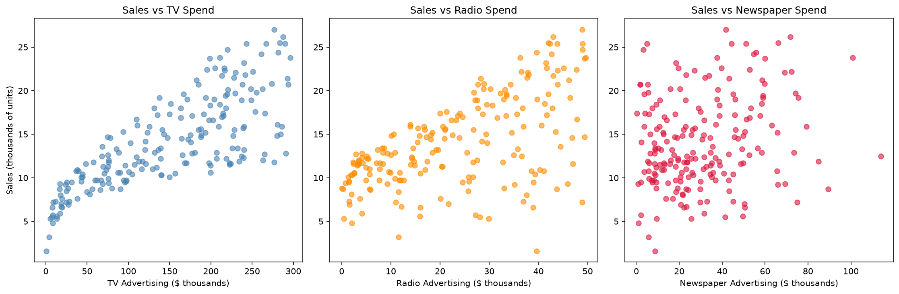
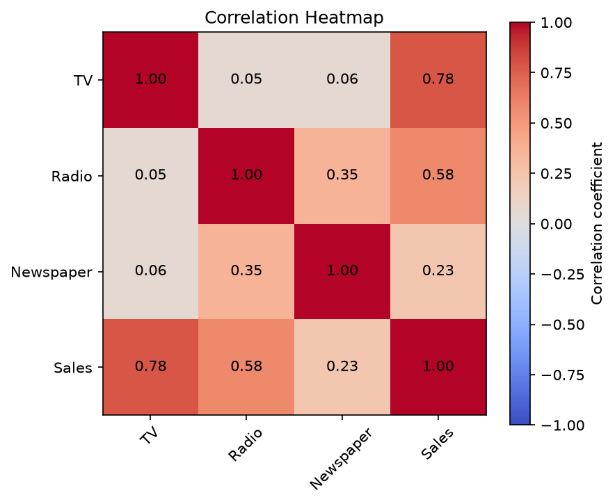
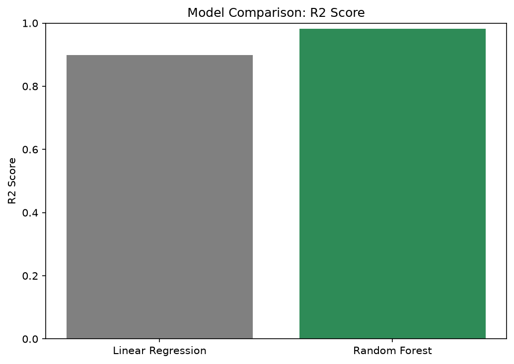
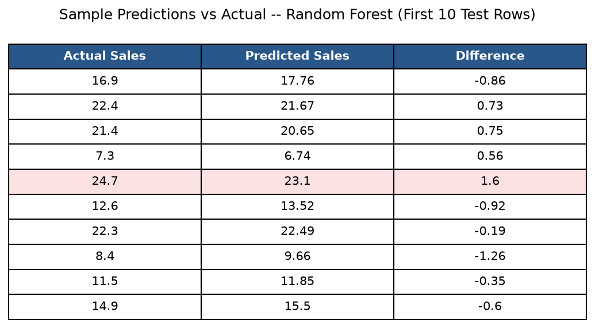
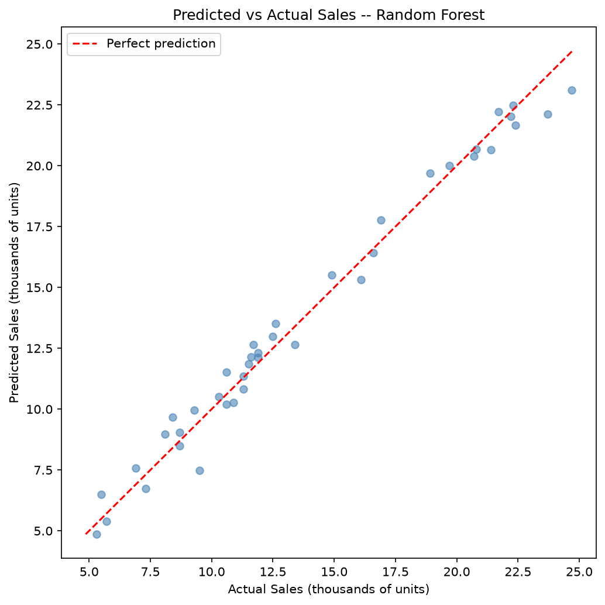
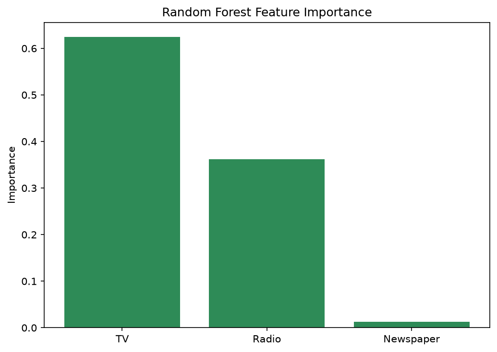
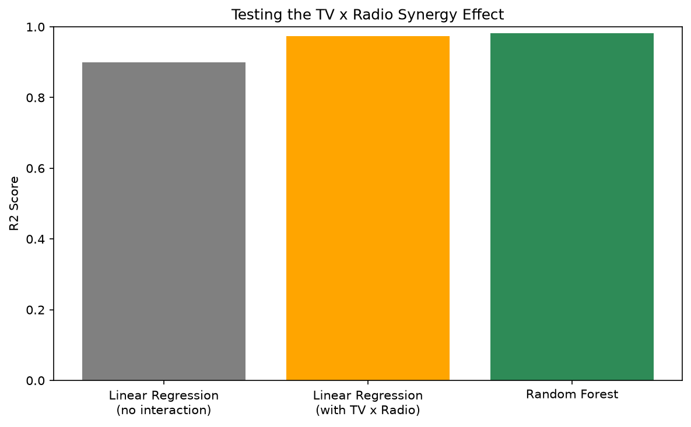

# CodeAlpha - Sales Prediction

## Overview
This project builds a machine learning model to predict product sales based on advertising spend across three channels: TV, Radio, and Newspaper.

This is Task 4 of my Data Science Internship at CodeAlpha.

## Dataset
The classic [Advertising dataset](https://www.kaggle.com/datasets/ashydv/advertising-dataset), containing 200 records of advertising spend (in $ thousands) and resulting sales (in thousands of units). The data was clean with no missing values; the only cleanup needed was dropping an unnamed index column.

| Channel | Correlation with Sales |
|---|---|
| TV | 0.78 |
| Radio | 0.58 |
| Newspaper | 0.23 |

## Tools & Libraries
- Python
- pandas — data loading and analysis
- matplotlib — data visualization
- scikit-learn — model training and evaluation (Linear Regression, Random Forest)

## Approach
1. Loaded the data and dropped the unnamed index column
2. Checked for missing values and computed correlations between each channel and Sales
3. Visualized the relationship between each advertising channel and Sales
4. Split data into training (80%) and testing (20%) sets
5. Trained and compared two models: Linear Regression and Random Forest Regressor
6. Evaluated both using Mean Absolute Error (MAE) and R² score, then selected the stronger model

## Data Exploration

TV spend shows the clearest relationship with Sales, Radio a moderate one, and Newspaper spend shows almost no relationship at all:

The correlation heatmap confirms this numerically -- TV correlates most strongly with Sales (0.78), while Newspaper barely correlates at all (0.23):

## Model Comparison

| Model | MAE | R² Score |
|---|---|---|
| Linear Regression | 1.46 | 0.899 |
| **Random Forest** | **0.63** | **0.982** |

Random Forest clearly outperformed Linear Regression. This is likely due to a well-documented **synergy effect** between TV and Radio advertising in this dataset -- spending on both channels together tends to boost sales more than their individual effects added up would suggest. A straight-line model can't represent that kind of interaction between features, while Random Forest naturally captures it. **Random Forest was selected as the final model.**

## Results

Using Random Forest, predictions closely track actual sales, with most falling within 1 unit of the true value:

The scatter below plots every test record's actual sales against its predicted sales -- points close to the red diagonal line represent accurate predictions:

**Final performance: Mean Absolute Error of 0.63 (thousands of units), R² of 0.982** -- the model explains 98.2% of the variation in sales based on advertising spend alone.

## Bonus Investigation

Two follow-up questions were tested to go beyond just picking the best model.

### 1. What does Random Forest actually rely on?

Correlation only measures each channel in isolation. Random Forest's feature importance reflects what the model actually used when making predictions -- and it tells a sharper story:

| Feature | Correlation | RF Importance |
|---|---|---|
| TV | 0.78 | 0.625 |
| Radio | 0.58 | 0.362 |
| Newspaper | 0.23 | **0.013** |

Newspaper's importance is far lower than its correlation suggested. This is likely because newspaper spend simply tends to rise and fall alongside TV/Radio spend in bigger campaigns, rather than driving sales on its own.

### 2. Is there really a TV x Radio synergy effect?

Rather than just assuming Random Forest's edge came from an interaction between channels, this was tested directly by adding a `TV x Radio` feature to Linear Regression:

| Model | R² Score |
|---|---|
| Linear Regression (no interaction) | 0.899 |
| Linear Regression (with TV x Radio) | 0.974 |
| Random Forest | 0.982 |

Adding a single interaction term closed nearly the entire gap between Linear Regression and Random Forest -- strong confirmation that TV and Radio advertising have a real combined effect on sales beyond their individual contributions.

### 3. Does Newspaper spend matter at all?

Given how low Newspaper's feature importance was, the model was re-tested with Newspaper removed entirely:

| Model | MAE | R² Score |
|---|---|---|
| TV + Radio + interaction only | 0.67 | 0.974 |
| All features + interaction | 0.67 | 0.974 |

The results are identical. This suggests newspaper advertising spend could realistically be reduced or reallocated toward TV and Radio with no meaningful loss in predictive accuracy -- a real, tested business takeaway rather than a guess.

## How to Run
1. Clone this repository
2. Install dependencies: `pip install pandas scikit-learn matplotlib`
3. Run `CodeAlpha_SalesPrediction.py`